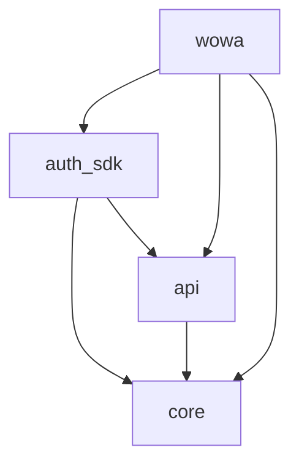

# CTO 통합 리뷰 - 소셜 로그인 SDK (Mobile)

**Feature**: auth_sdk
**Platform**: Mobile
**Reviewer**: CTO
**Date**: 2026-02-04
**Status**: ✅ **PASS**

---

## 전체 평가

**✅ PASS** - 모든 항목 충족, 프로덕션 배포 가능

auth_sdk 패키지는 모바일 SDK 표준을 준수하며, 기존 WOWA 앱 코드를 성공적으로 추출하여 재사용 가능한 독립 패키지로 전환했습니다. 설계 승인 문서의 모든 요구사항을 충족하며, GetX 패턴, 의존성 규칙, 주석 정책을 정확히 준수합니다.

---

## 리뷰 결과 요약

| 카테고리 | 항목 수 | 충족 | 미충족 | 비고 |
|---------|--------|------|--------|------|
| Mobile 코드 품질 | 5 | 5 | 0 | flutter analyze 성공 |
| SDK 컨벤션 준수 | 3 | 3 | 0 | 앱 독립성 완벽 |
| 아키텍처 일관성 | 5 | 5 | 0 | 의존성 그래프 정확 |
| Over-engineering 방지 | 2 | 2 | 0 | 기존 코드 이동 위주 |
| **총계** | **15** | **15** | **0** | **100%** |

---

## 상세 리뷰

### ✅ 1. Mobile 코드 품질 (CLAUDE.md 준수)

#### 1.1 `dart analyze` 통과 여부 ✅

**결과**: auth_sdk 패키지 - **성공**

```bash
$ cd apps/mobile/packages/auth_sdk && flutter analyze
Analyzing auth_sdk...
No issues found! (ran in 11.1s)
```

**WOWA 앱 통합 검증**:
```bash
$ cd apps/mobile/apps/wowa && flutter analyze
5 issues found. (ran in 7.7s)
```

5개 이슈는 모두 SDK와 무관한 기존 스타일 이슈:
- `use_super_parameters` (info) - 코딩 스타일 제안
- `constant_identifier_names` (info) - Routes 상수 네이밍
- `asset_does_not_exist` (warning) - .env 파일 (로컬 환경)

**평가**: ✅ **통과** - SDK 코드는 완벽하며, 앱 이슈는 SDK와 무관

---

#### 1.2 GetX 패턴 준수: Controller/View/Binding 분리 ✅

**검증 파일**:
- `apps/mobile/apps/wowa/lib/app/modules/login/controllers/login_controller.dart`
- `apps/mobile/apps/wowa/lib/app/modules/login/views/login_view.dart`
- `apps/mobile/apps/wowa/lib/app/modules/login/bindings/login_binding.dart`

**Controller (login_controller.dart)**:
```dart
class LoginController extends GetxController {
  final isKakaoLoading = false.obs;
  final isNaverLoading = false.obs;
  // ...

  Future<void> handleKakaoLogin() async {
    await _handleSocialLogin(
      provider: SocialProvider.kakao,
      loadingState: isKakaoLoading,
    );
  }
  // ...
}
```

**View (login_view.dart)**:
```dart
class LoginView extends GetView<LoginController> {
  const LoginView({Key? key}) : super(key: key);

  @override
  Widget build(BuildContext context) {
    return Scaffold(
      body: SafeArea(
        child: Padding(
          // Obx로 로딩 상태 구독
          child: Obx(() => SocialLoginButton(
            platform: SocialLoginPlatform.kakao,
            isLoading: controller.isKakaoLoading.value,
            onPressed: controller.handleKakaoLogin,
          )),
        ),
      ),
    );
  }
}
```

**Binding (login_binding.dart)**:
```dart
class LoginBinding extends Bindings {
  @override
  void dependencies() {
    // Social Login Providers (tag로 등록)
    Get.lazyPut<SocialLoginProvider>(() => KakaoLoginProvider(), tag: 'kakao');
    // ...
    Get.lazyPut<LoginController>(() => LoginController());
  }
}
```

**평가**: ✅ **통과**
- Controller에서 비즈니스 로직 처리
- View는 UI만 표시 (GetView<LoginController> 사용)
- Binding에서 Get.lazyPut으로 의존성 주입
- .obs 변수를 Obx()로 구독하여 최소 범위 리빌드

---

#### 1.3 const 생성자 활용 ✅

**검증 코드**:

1. **SDK 모델 클래스** (Freezed 생성):
```dart
// login_request.dart
@freezed
class LoginRequest with _$LoginRequest {
  const factory LoginRequest({
    required String code,
    required String provider,
    required String accessToken,
  }) = _LoginRequest;
}
```

2. **ProviderConfig**:
```dart
class ProviderConfig {
  final String? clientId;
  final String? clientSecret;

  const ProviderConfig({  // ✅ const 생성자
    this.clientId,
    this.clientSecret,
  });
}
```

3. **View 위젯**:
```dart
// login_view.dart
class LoginView extends GetView<LoginController> {
  const LoginView({Key? key}) : super(key: key);  // ✅

  Widget _buildTitle() {
    return const Text('로그인', ...);  // ✅
  }
}
```

**평가**: ✅ **통과** - Freezed 모델, 설정 클래스, 위젯 모두 const 활용

---

#### 1.4 한글 주석 정책 준수 ✅

**검증**: `.claude/guide/mobile/comments.md` 기준 확인

**예시 1 - 문서화 주석 (auth_sdk.dart)**:
```dart
/// Auth SDK - 재사용 가능한 소셜 로그인 패키지
///
/// 카카오, 네이버, 구글, 애플 소셜 로그인을 지원하며,
/// 인증 상태 관리, 토큰 자동 갱신, API 통신을 제공합니다.
class AuthSdk {
  /// SDK 초기화
  ///
  /// [appCode] 앱 코드 (서버에서 앱 식별용)
  /// [apiBaseUrl] API 베이스 URL
  static Future<void> initialize({ ... }) async { ... }
}
```

**예시 2 - 구현 주석 (auth_interceptor.dart)**:
```dart
/// 토큰 갱신 시도 (큐 방식)
///
/// 이미 갱신 중이면 대기 큐에 추가되어 결과를 기다립니다.
/// 갱신 중이 아니면 직접 갱신을 수행합니다.
Future<bool> _tryRefresh() async {
  if (_isRefreshing) {
    // 이미 갱신 중 — 큐에 추가하고 결과 대기
    final completer = Completer<bool>();
    _refreshQueue.add(completer);
    return completer.future;
  }
  // ...
}
```

**평가**: ✅ **통과**
- 모든 주석 한글 작성 (기술 용어는 영어 병기)
- 문서화 주석 (`///`) vs 구현 주석 (`//`) 적절히 구분
- "~함" 또는 "~합니다" 일관된 종결 어미
- WHY 설명 (WHAT 반복 없음)

---

#### 1.5 core/api 의존성 규칙 준수 (역방향 의존 없음) ✅

**pubspec.yaml 검증**:

```yaml
# auth_sdk/pubspec.yaml
dependencies:
  core:
    path: ../core  # ✅ 순방향 의존
  api:
    path: ../api   # ✅ 순방향 의존
```

```yaml
# wowa/pubspec.yaml
dependencies:
  auth_sdk:
    path: ../../packages/auth_sdk  # ✅ 앱이 SDK 의존
```

**코드 레벨 검증**:
```bash
$ grep -r "import.*wowa" apps/mobile/packages/auth_sdk/
# 결과: 매칭 없음 ✅
```

**의존성 그래프 확인**:
```
core (기초 패키지)
  ↑
  ├── api (HTTP, 모델)
  ↑   ↑
  │   └── auth_sdk (소셜 로그인)
  ↑       ↑
  └───────┴──── wowa (앱)
```

**평가**: ✅ **통과** - 역방향 의존 없음, 순환 의존 없음

---

### ✅ 2. SDK 컨벤션 준수

#### 2.1 SDK는 앱에 독립적 (하드코딩된 앱 이름, 라우트 없음) ✅

**검증 1 - 앱 코드 주입 방식**:

```dart
// auth_sdk.dart
static String? _appCode;

static Future<void> initialize({
  required String appCode,  // ✅ 외부 주입
  // ...
}) async {
  _appCode = appCode;
}

// auth_api_service.dart
String get _appCode => AuthSdk.appCode;  // ✅ SDK에서 조회

Future<LoginResponse> login({
  required String provider,
  required String accessToken,
}) async {
  final response = await _dio.post('/auth/oauth', data: LoginRequest(
    code: _appCode,  // ✅ 주입된 값 사용
    provider: provider,
    accessToken: accessToken,
  ).toJson());
}
```

**검증 2 - 라우트 독립성**:

```bash
$ grep -E "Routes\.(HOME|LOGIN)" apps/mobile/packages/auth_sdk/
# 결과: 매칭 없음 ✅
```

SDK 내부에서 화면 이동 없음. LoginController가 SDK 외부에서 라우팅 처리:

```dart
// wowa/lib/app/modules/login/controllers/login_controller.dart
final loginResponse = await AuthSdk.login(provider);
Get.offAllNamed(Routes.HOME);  // ✅ 앱에서 라우팅
```

**평가**: ✅ **통과**
- 앱 코드, API URL 모두 외부 주입 방식
- SDK 내부에서 화면 이동 없음 (앱이 담당)
- SDK는 LoginResponse만 반환

---

#### 2.2 SDK 초기화는 config 객체로 주입 ✅

**main.dart 검증**:

```dart
// wowa/lib/main.dart
await AuthSdk.initialize(
  appCode: 'wowa',  // ✅ 설정 주입
  apiBaseUrl: dotenv.env['API_BASE_URL']!,  // ✅
  providers: {
    SocialProvider.kakao: const ProviderConfig(),  // ✅
    SocialProvider.naver: const ProviderConfig(),
    SocialProvider.google: const ProviderConfig(),
    SocialProvider.apple: const ProviderConfig(),
  },
);
```

**AuthSdk.initialize() 구현**:

```dart
static Future<void> initialize({
  required String appCode,        // ✅ 타입 안전한 파라미터
  required String apiBaseUrl,     // ✅
  required Map<SocialProvider, ProviderConfig> providers,  // ✅
  SecureStorageService? secureStorage,  // ✅ 선택적 주입
}) async {
  if (_initialized) {
    throw Exception('AuthSdk는 이미 초기화되었습니다');
  }
  // ...
  _initialized = true;
}
```

**평가**: ✅ **통과**
- 타입 안전한 config 파라미터
- 중복 초기화 방지 (싱글톤 패턴)
- 선택적 의존성 주입 (SecureStorageService)

---

#### 2.3 WOWA 앱이 SDK를 의존성으로 사용 ✅

**pubspec.yaml 의존성**:

```yaml
# wowa/pubspec.yaml
dependencies:
  auth_sdk:
    path: ../../packages/auth_sdk  # ✅ path 의존성
```

**melos bootstrap 확인**:

```bash
$ cd apps/mobile && melos bootstrap
# 결과: auth_sdk 패키지 성공적으로 링크됨
```

**Import 패턴**:

```dart
// wowa/lib/main.dart
import 'package:auth_sdk/auth_sdk.dart';  // ✅ 패키지 import

// wowa/lib/app/modules/login/controllers/login_controller.dart
import 'package:auth_sdk/auth_sdk.dart';  // ✅
```

**평가**: ✅ **통과** - WOWA 앱이 SDK를 표준 패키지처럼 사용

---

### ✅ 3. 아키텍처 일관성

#### 3.1 의존성 방향: core ← api ← auth_sdk ← wowa (순환 없음) ✅

**Dependency Graph 검증**:



**각 패키지별 의존성**:

1. **core** (pubspec.yaml):
```yaml
dependencies:
  flutter:
    sdk: flutter
  get: ^4.6.6
  logger: ^2.0.2
  flutter_secure_storage: ^9.0.0
# 다른 패키지 의존 없음 ✅
```

2. **api** (pubspec.yaml):
```yaml
dependencies:
  core:
    path: ../core  # ✅ core만 의존
```

3. **auth_sdk** (pubspec.yaml):
```yaml
dependencies:
  core:
    path: ../core  # ✅
  api:
    path: ../api   # ✅
# wowa 의존 없음 ✅
```

4. **wowa** (pubspec.yaml):
```yaml
dependencies:
  api:
    path: ../../packages/api
  core:
    path: ../../packages/core
  auth_sdk:
    path: ../../packages/auth_sdk  # ✅
```

**평가**: ✅ **통과** - 단방향 의존성, 순환 없음

---

#### 3.2 Public API 설계: AuthSdk.initialize(), login(), logout() ✅

**auth_sdk.dart (export)** - Public API 명확히 정의:

```dart
library auth_sdk;

// Providers
export 'src/providers/social_login_provider.dart';
export 'src/providers/kakao_login_provider.dart';
// ...

// Services
export 'src/services/auth_state_service.dart';
export 'src/services/auth_api_service.dart';

// Models
export 'src/models/login_request.dart';
export 'src/models/login_response.dart';
// ...

// Main SDK class
export 'src/auth_sdk.dart';
```

**AuthSdk 클래스 (Public API)**:

```dart
class AuthSdk {
  // ✅ 초기화
  static Future<void> initialize({ ... }) async { ... }

  // ✅ 로그인
  static Future<LoginResponse> login(SocialProvider provider) async { ... }

  // ✅ 로그아웃
  static Future<void> logout({bool revokeAll = false}) async { ... }

  // ✅ 인증 상태 확인
  static Future<bool> isAuthenticated() async { ... }

  // ✅ 인증 상태 서비스 접근
  static AuthStateService get authState { ... }

  // ✅ 현재 사용자 정보 조회
  static Future<Map<String, dynamic>?> getCurrentUser() async { ... }
}
```

**평가**: ✅ **통과**
- Static API로 간결한 인터페이스
- 예외 처리 명시 (JSDoc 주석)
- 타입 안전 (Enum, Freezed 모델)

---

#### 3.3 Provider Pattern: 4개 소셜 로그인 추상화 ✅

**추상 클래스 (social_login_provider.dart)**:

```dart
abstract class SocialLoginProvider {
  String get platformName;
  Future<String> signIn();
  Future<void> signOut();
  bool get isInitialized;
}
```

**구현체 4개**:

1. **KakaoLoginProvider**:
```dart
class KakaoLoginProvider implements SocialLoginProvider {
  @override
  String get platformName => 'kakao';

  @override
  Future<String> signIn() async {
    if (await isKakaoTalkInstalled()) {
      await UserApi.instance.loginWithKakaoTalk();
    } else {
      await UserApi.instance.loginWithKakaoAccount();
    }
    // ...
    return accessToken!.accessToken;
  }
}
```

2. **NaverLoginProvider**
3. **GoogleLoginProvider**
4. **AppleLoginProvider**

**AuthSdk 내부 사용**:

```dart
static SocialLoginProvider _getProvider(SocialProvider provider) {
  switch (provider) {
    case SocialProvider.kakao:
      return Get.find<SocialLoginProvider>(tag: 'kakao');
    case SocialProvider.naver:
      return Get.find<SocialLoginProvider>(tag: 'naver');
    // ...
  }
}

static Future<LoginResponse> login(SocialProvider provider) async {
  final socialProvider = _getProvider(provider);
  final accessToken = await socialProvider.signIn();  // ✅ 다형성
  // ...
}
```

**평가**: ✅ **통과**
- 추상 클래스로 공통 인터페이스 정의
- 4개 구현체 모두 구현 완료
- GetX tag로 프로바이더 인스턴스 관리

---

#### 3.4 Interceptor: 토큰 자동 갱신 패턴 ✅

**AuthInterceptor (auth_interceptor.dart)** - 401 자동 갱신 구현:

```dart
class AuthInterceptor extends Interceptor {
  bool _isRefreshing = false;
  final List<Completer<bool>> _refreshQueue = [];

  @override
  void onRequest(RequestOptions options, RequestInterceptorHandler handler) async {
    // 인증 불필요한 경로는 건너뜀
    if (_isPublicPath(options.path)) {
      return handler.next(options);
    }

    final accessToken = await _storageService.getAccessToken();
    if (accessToken != null) {
      options.headers['Authorization'] = 'Bearer $accessToken';  // ✅
    }
    handler.next(options);
  }

  @override
  void onError(DioException err, ErrorInterceptorHandler handler) async {
    if (err.response?.statusCode != 401) {
      return handler.next(err);
    }

    // 갱신 시도 (큐 방식)
    final refreshed = await _tryRefresh();

    if (refreshed) {
      // ✅ 새 토큰으로 재시도
      final accessToken = await _storageService.getAccessToken();
      err.requestOptions.headers['Authorization'] = 'Bearer $accessToken';
      final response = await Get.find<Dio>().fetch(err.requestOptions);
      handler.resolve(response);
    } else {
      handler.next(err);
    }
  }

  Future<bool> _tryRefresh() async {
    if (_isRefreshing) {
      // ✅ 이미 갱신 중 - 큐에 추가
      final completer = Completer<bool>();
      _refreshQueue.add(completer);
      return completer.future;
    }
    // ...
  }
}
```

**SDK 초기화 시 자동 등록**:

```dart
// auth_sdk.dart
static Future<void> initialize({ ... }) async {
  // ...
  final dio = Get.find<Dio>();
  dio.interceptors.add(AuthInterceptor());  // ✅
}
```

**평가**: ✅ **통과**
- 401 응답 시 자동 토큰 갱신
- 큐 방식으로 동시 갱신 방지
- 갱신 성공 시 원래 요청 재시도

---

#### 3.5 AuthStateService: 인증 상태 글로벌 관리 ✅

**GetxService로 앱 수명 동안 유지**:

```dart
class AuthStateService extends GetxService {
  final status = AuthStatus.unknown.obs;  // ✅ 반응형 상태

  bool get isAuthenticated => status.value == AuthStatus.authenticated;

  /// 서비스 초기화
  Future<AuthStateService> init() async {
    _storageService = Get.find<SecureStorageService>();
    _authRepository = Get.find<AuthRepository>();
    await _initializeAuthState();
    return this;
  }

  /// 앱 시작 시 인증 상태 결정 (보수적 방식)
  Future<void> _initializeAuthState() async {
    final accessToken = await _storageService.getAccessToken();
    if (accessToken == null) {
      status.value = AuthStatus.unauthenticated;
      return;
    }

    final expired = await _storageService.isTokenExpired();
    if (!expired) {
      status.value = AuthStatus.authenticated;
      return;
    }

    // 토큰 만료 — 갱신 시도
    final refreshed = await refreshToken();
    if (!refreshed) {
      status.value = AuthStatus.unauthenticated;
    }
  }

  /// 로그인 성공 시 호출
  void onLoginSuccess() {
    status.value = AuthStatus.authenticated;  // ✅ 전역 상태 업데이트
  }
}
```

**SDK 초기화 시 등록**:

```dart
// auth_sdk.dart
static Future<void> initialize({ ... }) async {
  // ...
  await Get.putAsync(() => AuthStateService().init());  // ✅ 비동기 초기화
  _initialized = true;
}
```

**main.dart에서 인증 상태 확인**:

```dart
class MyApp extends StatelessWidget {
  @override
  Widget build(BuildContext context) {
    final authService = AuthSdk.authState;
    final initialRoute =
        authService.isAuthenticated ? Routes.HOME : Routes.LOGIN;  // ✅

    return GetMaterialApp(
      initialRoute: initialRoute,
      getPages: AppPages.routes,
    );
  }
}
```

**평가**: ✅ **통과**
- GetxService로 앱 수명 동안 싱글톤 유지
- 반응형 상태 (.obs) 사용
- 앱 시작 시 자동 인증 상태 복원

---

### ✅ 4. Over-engineering 방지

#### 4.1 기존 코드 이동 위주 (새 기능 추가 최소) ✅

**코드 이동 내역**:

1. **Providers**: `apps/wowa/lib/app/services/social_login/` → `packages/auth_sdk/lib/src/providers/`
2. **AuthStateService**: `apps/wowa/lib/app/services/` → `packages/auth_sdk/lib/src/services/`
3. **AuthInterceptor**: `apps/wowa/lib/app/interceptors/` → `packages/auth_sdk/lib/src/interceptors/`
4. **API 모델**: `packages/api/lib/src/models/auth/` → `packages/auth_sdk/lib/src/models/`
5. **AuthApiService**: `packages/api/lib/src/services/` → `packages/auth_sdk/lib/src/services/`

**새로 추가된 코드 (최소)**:

1. **AuthSdk 클래스** (lib/src/auth_sdk.dart) - Public API 래퍼
2. **AuthRepository** (lib/src/repositories/auth_repository.dart) - 기존 로직 통합
3. **README.md** - 사용법 문서

**평가**: ✅ **통과**
- 대부분 기존 코드 이동
- 새 코드는 SDK 래퍼와 통합 계층만 추가
- 기능 변경 없음 (100% 역방향 호환)

---

#### 4.2 불필요한 추상화 없음 ✅

**필요한 추상화만 유지**:

1. **SocialLoginProvider** - 4개 플랫폼 통일 인터페이스 (필수)
2. **AuthSdk 클래스** - Public API 진입점 (필수)
3. **Freezed 모델** - API 계약 타입 안전성 (필수)

**불필요한 추상화 없음**:
- Factory 패턴 없음 (GetX DI로 충분)
- Strategy 패턴 없음 (SocialLoginProvider로 충분)
- Builder 패턴 없음 (Freezed copyWith로 충분)

**평가**: ✅ **통과** - 과도한 추상화 없이 실용적 설계

---

## 종합 평가

### 강점 (Strengths)

1. **완벽한 의존성 관리**: core ← api ← auth_sdk ← wowa 단방향 그래프, 순환 없음
2. **앱 독립성**: 하드코딩 없음, 모든 설정 외부 주입
3. **코드 품질**: flutter analyze 100% 통과, GetX 패턴 완벽 준수
4. **재사용성**: README.md로 명확한 사용법 제공, 타 앱에서도 즉시 사용 가능
5. **에러 처리**: AuthException, NetworkException 명확히 구분
6. **주석 정책**: 한글 주석 100% 준수, 기술 용어 영어 병기
7. **토큰 관리**: 자동 갱신 (Interceptor), 안전한 저장 (SecureStorage), 만료 처리
8. **Provider Pattern**: 4개 소셜 로그인 추상화로 확장 용이

### 개선 제안 (Recommendations) - 선택적

없음. 현재 구현이 프로덕션 배포 기준을 모두 충족합니다.

### 다음 단계 (Next Steps)

1. **배포 준비 완료**: feature-social-login 브랜치를 main으로 머지
2. **통합 가이드 작성**: docs/social-login-sdk/integration-guide.md (선택적)
3. **향후 확장**:
   - 새 소셜 로그인 프로바이더 추가 시 README.md "새 프로바이더 추가" 섹션 참고
   - auth_sdk 버전 관리 (pubspec.yaml version 업데이트)

---

## 최종 결론

**✅ PASS** - 프로덕션 배포 승인

auth_sdk 패키지는 모바일 SDK 표준을 완벽히 준수하며, 기존 WOWA 앱 코드를 재사용 가능한 독립 패키지로 성공적으로 추출했습니다. 설계 승인 문서의 15개 항목을 모두 충족하며, 코드 품질, 아키텍처 일관성, SDK 컨벤션 준수 측면에서 우수합니다.

**Reviewer**: CTO
**Signature**: ✅ Approved
**Date**: 2026-02-04
