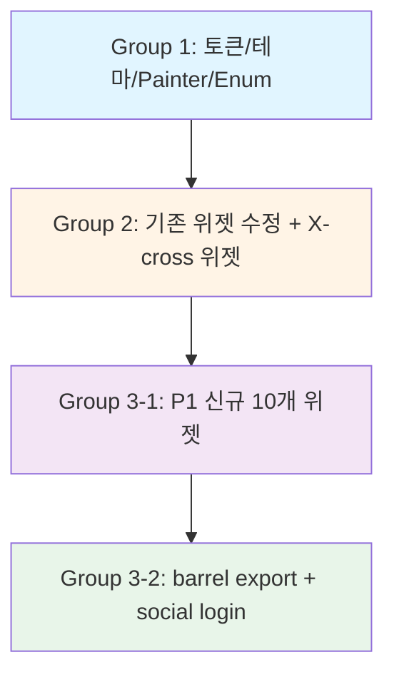

# Mobile Work Plan: Design System v2 (Frame0 시각 언어 일치)

- **Feature**: design-system
- **Platform**: Mobile (Flutter)
- **작성일**: 2026-02-10
- **총 개발자 수**: 4명 (flutter-developer)
- **예상 기간**: 3 그룹 순차 실행

---

## 실행 그룹 (Execution Groups)

### Group 1 (병렬) — 토큰/테마 기반 작업

토큰과 테마는 모든 위젯이 의존하므로 **최우선 순위**로 완료합니다. 이 그룹의 작업들은 서로 독립적이므로 병렬 실행 가능합니다.

| Agent | Module | 파일 | 설명 | 예상 시간 |
|-------|--------|------|------|----------|
| flutter-developer-1 | tokens | `apps/mobile/packages/core/lib/sketch_design_tokens.dart` | 새 배경색, 액센트 색상, 텍스트 색상, outline 색상, 의미론적 색상 다크모드 변형 추가 | 30분 |
| flutter-developer-2 | theme | `apps/mobile/packages/design_system/lib/src/theme/sketch_theme_extension.dart` | light()/dark() 팩토리 메서드의 fillColor 변경 (#FAF8F5, #1A1D29) | 15분 |
| flutter-developer-3 | x-cross-painter | `apps/mobile/packages/design_system/lib/src/painters/x_cross_painter.dart` | X-cross 패턴 렌더링용 CustomPainter 구현 | 45분 |
| flutter-developer-4 | enums | 4개 enum 파일 생성 (sketch_tab_indicator_style, sketch_nav_label_behavior, sketch_avatar_size, sketch_avatar_shape) | Enum 정의 | 20분 |

**의존성**: 없음 (병렬 실행)

**완료 조건**:
- [ ] `sketch_design_tokens.dart`에 새 색상 상수 추가 완료
- [ ] `sketch_theme_extension.dart`의 light/dark fillColor 변경 완료
- [ ] `x_cross_painter.dart` 구현 및 유닛 테스트 통과
- [ ] 4개 enum 파일 생성 완료

**Module Contracts**:
- **tokens → 모든 위젯**: 다음 상수 제공 필수
  - `SketchDesignTokens.background`, `surfaceVariant`, `accentPrimary`, `accentPrimaryLight`, `textPrimary`, `outlinePrimary` 등
  - 모든 Group 2, 3의 위젯이 이 상수를 참조함
- **theme → 모든 위젯**: `SketchThemeExtension.light().fillColor` / `dark().fillColor`가 변경됨
  - 기존 위젯의 기본 배경색이 자동으로 크림색/네이비로 변경됨
- **x_cross_painter → sketch_image_placeholder**: `XCrossPainter` 클래스 제공
- **enums → 해당 위젯**: 각 위젯이 import하여 사용

---

### Group 2 (병렬) — 기존 위젯 수정 + P0 신규 위젯

Group 1 완료 후 실행합니다. 이 그룹의 작업들은 서로 독립적인 파일을 수정하므로 병렬 실행 가능합니다.

| Agent | Module | 파일 | 설명 | 예상 시간 |
|-------|--------|------|------|----------|
| flutter-developer-1 | button-container-card | `sketch_button.dart`, `sketch_container.dart`, `sketch_card.dart` | (1) button: pill 형태 borderRadius 변경 (2) container: 기본 fillColor null → background (3) card: withOpacity() 수정 + 미사용 파라미터 제거 | 1시간 |
| flutter-developer-2 | input-dropdown | `sketch_input.dart`, `sketch_dropdown.dart` | (1) input: ColorSpec → _ColorSpec (2) dropdown: barrier 추가, overlay 안정성 개선 + 미사용 파라미터 제거 | 1시간 |
| flutter-developer-3 | chip-icon-slider-switch | `sketch_chip.dart`, `sketch_icon_button.dart`, `sketch_slider.dart`, `sketch_switch.dart` | 4개 위젯에서 미사용 roughness/seed/bowing/enableNoise 파라미터 제거 | 45분 |
| flutter-developer-4 | image-placeholder | `sketch_image_placeholder.dart` | X-cross 플레이스홀더 위젯 구현 (P0) — 4개 프리셋(xs/sm/md/lg) + XCrossPainter 사용 | 1시간 |

**의존성**: Group 1 완료 필수 (tokens, theme, x_cross_painter, enums)

**완료 조건**:
- [ ] `sketch_button.dart`: 기본 borderRadius가 pill 형태 (9999 또는 height/2)
- [ ] `sketch_container.dart`: fillColor 기본값이 null → `SketchDesignTokens.background` (라이트모드) 또는 context 기반 테마 색상
- [ ] `sketch_card.dart`: `withOpacity()` → `withValues(alpha:)` 수정 완료
- [ ] `sketch_input.dart`: `ColorSpec` 클래스가 `_ColorSpec`로 private 처리
- [ ] `sketch_dropdown.dart`: 외부 탭 시 barrier로 자동 닫힘 구현
- [ ] 8개 위젯: 미사용 파라미터 완전 제거 (roughness, seed, bowing, enableNoise)
- [ ] `sketch_image_placeholder.dart`: 4개 프리셋 팩토리 메서드 구현, X-cross 렌더링 정상 작동

**Module Contracts**:
- **tokens → 위젯**: `SketchDesignTokens.background`, `accentPrimary` 등 사용
- **x_cross_painter → image_placeholder**: `XCrossPainter` 클래스 import

---

### Group 3 (병렬) — P1 신규 위젯 + 통합

Group 2 완료 후 실행합니다. 10개 신규 위젯은 서로 독립적이므로 병렬 실행 가능하며, 통합 작업은 위젯 구현 완료 후 순차 실행합니다.

#### 3-1. P1 신규 위젯 (병렬)

| Agent | Module | 파일 | 설명 | 예상 시간 |
|-------|--------|------|------|----------|
| flutter-developer-1 | tab-bar + bottom-nav | `sketch_tab_bar.dart`, `sketch_bottom_navigation_bar.dart` | (1) TabBar: 2~5개 탭, 인디케이터, 선택 상태 (2) BottomNav: 2~5개 항목, 배지, 선택 상태 | 2시간 |
| flutter-developer-2 | avatar + radio | `sketch_avatar.dart`, `sketch_radio.dart` | (1) Avatar: circle/square, xs/sm/md/lg, 이미지/이니셜/아이콘 (2) Radio: 단일 선택, 그룹 관리 | 1.5시간 |
| flutter-developer-3 | search + textarea + number | `sketch_search_input.dart`, `sketch_text_area.dart`, `sketch_number_input.dart` | (1) SearchInput: 돋보기 아이콘, X 버튼 (2) TextArea: 여러 줄, 글자 수 카운터 (3) NumberInput: 숫자 키보드, +/- 버튼 | 2시간 |
| flutter-developer-4 | divider + link + app-bar | `sketch_divider.dart`, `sketch_link.dart`, `sketch_app_bar.dart` | (1) Divider: 수평/수직, 손그림/직선 (2) Link: 파란색, 밑줄, 방문 상태 (3) AppBar: 제목, leading, actions | 2시간 |

**의존성**: Group 2 완료 필수 (기존 위젯 수정 완료, 토큰 확정)

**완료 조건**:
- [ ] 10개 위젯 모두 mobile-design-spec.md 명세 100% 구현
- [ ] 각 위젯에 const 생성자, JSDoc 주석(한글), 최소 1개 프리셋 팩토리 메서드 제공
- [ ] GetX Obx 호환성 확인 (reactive 변수 바인딩 테스트)
- [ ] 접근성: 시맨틱 레이블, 터치 타겟 44x44pt 이상, WCAG AA 대비
- [ ] `flutter analyze` 경고 없음

**Module Contracts**:
- **tokens → 모든 신규 위젯**: `accentPrimary` (링크, 선택 상태), `fontFamilyHand` (손글씨체) 사용
- **enums → 해당 위젯**: `SketchTabIndicatorStyle`, `SketchNavLabelBehavior`, `SketchAvatarSize`, `SketchAvatarShape` import

#### 3-2. 통합 작업 (순차 — 3-1 완료 후)

| Agent | Module | 파일 | 설명 | 예상 시간 |
|-------|--------|------|------|----------|
| flutter-developer-1 | barrel-export + social-login | `design_system.dart`, `social_login_button.dart` | (1) barrel export 업데이트 (11개 신규 위젯 추가, Calculator 삭제) (2) social_login_button에 sketchStyle 옵션 추가 | 30분 |

**의존성**: 3-1 완료 필수

**완료 조건**:
- [ ] `design_system.dart`에 11개 신규 위젯 export 추가
- [ ] `Calculator` 클래스 완전 삭제
- [ ] `social_login_button.dart`: `sketchStyle: true/false` 파라미터 추가
- [ ] 모든 위젯 import 오류 없음

---

## 파일 충돌 방지 전략

### 독립 파일 작업 원칙
- **각 Agent는 서로 다른 파일을 수정**하여 Git 충돌 방지
- **공통 파일 수정은 순차 실행**:
  - `design_system.dart` (barrel export): Group 3-2에서 단독 수정
  - `sketch_design_tokens.dart`: Group 1에서 단독 수정

### Group별 파일 소유권

#### Group 1
- flutter-developer-1: `sketch_design_tokens.dart` (단독)
- flutter-developer-2: `sketch_theme_extension.dart` (단독)
- flutter-developer-3: `x_cross_painter.dart` (단독, 신규 생성)
- flutter-developer-4: 4개 enum 파일 (단독, 신규 생성)

#### Group 2
- flutter-developer-1: `sketch_button.dart`, `sketch_container.dart`, `sketch_card.dart` (단독)
- flutter-developer-2: `sketch_input.dart`, `sketch_dropdown.dart` (단독)
- flutter-developer-3: `sketch_chip.dart`, `sketch_icon_button.dart`, `sketch_slider.dart`, `sketch_switch.dart` (단독)
- flutter-developer-4: `sketch_image_placeholder.dart` (단독, 신규 생성)

#### Group 3-1
- flutter-developer-1: `sketch_tab_bar.dart`, `sketch_bottom_navigation_bar.dart` (단독, 신규 생성)
- flutter-developer-2: `sketch_avatar.dart`, `sketch_radio.dart` (단독, 신규 생성)
- flutter-developer-3: `sketch_search_input.dart`, `sketch_text_area.dart`, `sketch_number_input.dart` (단독, 신규 생성)
- flutter-developer-4: `sketch_divider.dart`, `sketch_link.dart`, `sketch_app_bar.dart` (단독, 신규 생성)

#### Group 3-2
- flutter-developer-1: `design_system.dart`, `social_login_button.dart` (단독)

---

## 품질 검증 체크리스트

### Group 1 완료 기준
- [ ] `flutter analyze` 경고 없음
- [ ] 토큰 상수 추가 완료: `background`, `surfaceVariant`, `accentPrimary`, `accentPrimaryLight`, `textPrimary`, `outlinePrimary` 등
- [ ] 테마 fillColor 변경 완료: 라이트 `#FAF8F5`, 다크 `#1A1D29`
- [ ] XCrossPainter 단위 테스트 통과 (대각선 X 렌더링 확인)

### Group 2 완료 기준
- [ ] CRITICAL 이슈 4건 모두 수정 완료 (ColorSpec private, dropdown barrier, withOpacity, doc-string)
- [ ] WARNING 이슈 4건 모두 수정 완료 (미사용 파라미터 제거, Calculator 삭제는 Group 3-2에서)
- [ ] 기존 13개 위젯 모두 정상 작동 (regression 없음)
- [ ] SketchButton: pill 형태 borderRadius 적용 확인
- [ ] SketchContainer: 기본 배경색이 크림색으로 변경 확인
- [ ] SketchImagePlaceholder: X-cross 패턴 렌더링 확인

### Group 3 완료 기준
- [ ] 10개 신규 위젯 모두 design-spec.md 명세 100% 구현
- [ ] 모든 위젯에 const 생성자, JSDoc 주석(한글), 프리셋 팩토리 메서드
- [ ] GetX Obx 호환성 확인
- [ ] 접근성 기준 충족 (WCAG AA 대비, 터치 타겟 크기, 시맨틱 레이블)
- [ ] `flutter analyze` 경고 없음
- [ ] barrel export 업데이트 완료 (11개 위젯 추가, Calculator 삭제)
- [ ] social_login_button sketchStyle 옵션 작동 확인

---

## 의존성 그래프

---

## 크로스 플랫폼 의존성 분석

본 Feature는 **Mobile 전용**이므로 Server API 의존성이 없습니다. 모든 작업은 로컬 Flutter 패키지 내에서 독립적으로 완료됩니다.

---

## 예상 일정 (4명 병렬 작업 기준)

| 그룹 | 작업 기간 | 비고 |
|------|----------|------|
| Group 1 | 1시간 | 토큰/테마/Painter/Enum 병렬 작업 |
| Group 2 | 1시간 | 기존 위젯 수정 + X-cross 위젯 병렬 작업 |
| Group 3-1 | 2시간 | P1 신규 10개 위젯 병렬 작업 |
| Group 3-2 | 30분 | barrel export + social login 통합 |
| **총 예상 기간** | **4.5시간** | 병렬 실행으로 최소화 |

> **Note**: 순차 실행 시 12시간 이상 소요되지만, 병렬 작업으로 **4.5시간으로 단축** 가능.

---

## Sub Agent 할당 요약

| Agent | 총 작업량 | 주요 담당 |
|-------|----------|----------|
| flutter-developer-1 | 6개 파일 (tokens, button/container/card, tab-bar/bottom-nav, barrel export) | 토큰 정의, 핵심 위젯, 통합 |
| flutter-developer-2 | 5개 파일 (theme, input/dropdown, avatar/radio) | 테마, 입력 위젯, 프로필 위젯 |
| flutter-developer-3 | 8개 파일 (x-cross-painter, 4개 미사용 파라미터 제거, search/textarea/number) | Painter, 품질 개선, 입력 위젯 |
| flutter-developer-4 | 7개 파일 (4 enums, image-placeholder, divider/link/app-bar) | Enum, 플레이스홀더, 레이아웃 위젯 |

---

## 참조 문서

- **User Story**: `docs/wowa/design-system/user-story.md`
- **Design Spec**: `docs/wowa/design-system/mobile-design-spec.md`
- **Technical Brief**: `docs/wowa/design-system/mobile-brief.md`
- **Gap Analysis**: `docs/wowa/design-system/analysis.md`
- **Flutter Best Practices**: `.claude/guide/mobile/flutter_best_practices.md`
- **GetX Best Practices**: `.claude/guide/mobile/getx_best_practices.md`
- **Design System Guide**: `.claude/guide/mobile/design_system.md`
- **Design Tokens**: `.claude/guide/mobile/design-tokens.json`

---

## 다음 단계

1. **CTO 승인 후**: 각 Group별로 Task 도구를 사용하여 flutter-developer 서브에이전트 호출
2. **Group 1 완료 확인**: 토큰/테마 변경 완료 → Group 2 시작
3. **Group 2 완료 확인**: 기존 위젯 수정 완료 → Group 3-1 시작
4. **Group 3-1 완료 확인**: 신규 위젯 완료 → Group 3-2 통합 시작
5. **통합 완료 후**: CTO가 통합 리뷰 수행 (`mobile-cto-review.md` 생성)
